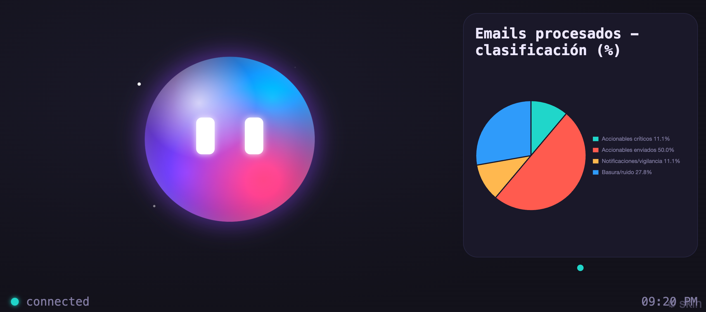
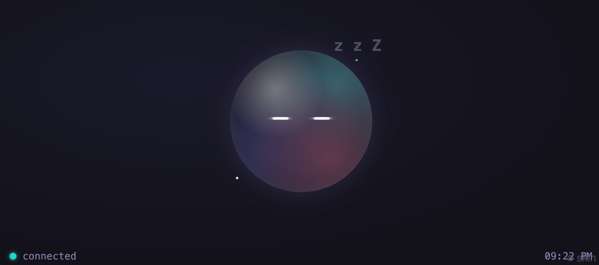

# Tamaclaw 🥚🦞

Animated companion display for [OpenClaw](https://github.com/openclaw) — a
digital pet that lives on a small screen connected to a Mac mini and acts as
the agent's "face." It speaks out loud, shows emotions, pushes notifications,
renders dashboard charts, and displays rich content cards.

One npm package = everything: OpenClaw plugin + HTTP bridge + kiosk display.




[](https://www.npmjs.com/package/tamaclaw)

---

## Table of contents

1. [Quick start (one command)](#quick-start-one-command)
2. [Requirements](#requirements)
3. [Manual installation (step by step)](#manual-installation-step-by-step)
4. [Standalone mode (no OpenClaw)](#standalone-mode-no-openclaw)
5. [Opening the display](#opening-the-display)
6. [Usage examples](#usage-examples)
7. [Pets (skins)](#pets-skins)
8. [REST API reference](#rest-api-reference)
9. [Voice (TTS)](#voice-tts)
10. [Screen wake](#screen-wake)
11. [Native window (no browser)](#native-window-no-browser)
12. [Character behavior](#character-behavior)
13. [Configuration reference](#configuration-reference)
14. [Project structure](#project-structure)
15. [Development](#development)

---

## Quick start (one command)

No need to clone anything. Run this directly from your terminal:

```bash
bash <(curl -fsSL https://raw.githubusercontent.com/gosbx/Tamaclaw/main/launch.sh)
```

Or in Chrome kiosk mode (fullscreen, no browser UI):

```bash
bash <(curl -fsSL https://raw.githubusercontent.com/gosbx/Tamaclaw/main/launch.sh) --kiosk
```

That's it. The script will:

1. Check Node >= 23.6 and `openclaw` CLI
2. Install the `tamaclaw` plugin (if not already installed)
3. Update it (if a newer version exists on npm)
4. Enable the plugin
5. Restart the OpenClaw Gateway
6. Wait for the bridge to come up on port 4321
7. Open the display in your browser
8. Return control to your terminal

If OpenClaw is not installed, it switches to standalone mode automatically.

**From a local clone** (same thing, but offline):

```bash
git clone https://github.com/gosbx/Tamaclaw.git
cd Tamaclaw
npm install
./launch.sh              # or: ./launch.sh --kiosk
```

On first launch you pick your pet, and you're done.

---

## Requirements

- **macOS** (TTS and screen wake use macOS APIs)
- **Node.js >= 23.6** (runs TypeScript natively — no build step)

---

## Manual installation (step by step)

If you prefer to do it manually instead of using `./launch.sh`:

### Step 1 — Install the plugin

```bash
openclaw plugins install tamaclaw
```

### Step 2 — Enable it

```bash
openclaw plugins enable tamaclaw
```

### Step 3 — Restart the Gateway

```bash
# however you restart your Gateway — the bridge starts automatically with it
openclaw restart
```

The bridge is now serving the display at `http://localhost:4321`.

### Step 4 — Open the display

On the kiosk Mac (or any browser on the same network):

```bash
open http://localhost:4321
```

On first launch you'll see the **pet picker** — tap a pet to preview it live,
then confirm. Done. The agent now has a face.

### Without npm (private/offline install)

```bash
# from this repo:
npm run pack                   # → dist/tamaclaw-0.1.3.tgz
openclaw plugins install ./dist/tamaclaw-0.1.3.tgz
openclaw plugins enable tamaclaw
openclaw restart
```

### Local development (symlink)

```bash
openclaw plugins install --link ./packages/tamaclaw
# or: npm run install-plugin   (copies to ~/.openclaw/extensions/tamaclaw)
openclaw plugins enable tamaclaw
openclaw restart
```

### Troubleshooting: bridge doesn't start after install/update

The Gateway sometimes doesn't auto-start the bridge after a plugin
install or update. If `http://localhost:4321` doesn't respond, run this
one-liner to start it manually (it stays in the background):

```bash
kill $(lsof -ti :4321) 2>/dev/null; BRIDGE=$(find ~/.openclaw -name "main.js" -path "*/tamaclaw/dist/bridge/*" -type f | head -1) && nohup node "$BRIDGE" > /tmp/tamaclaw-bridge.log 2>&1 & open http://localhost:4321
```

What it does: kills any old bridge on port 4321, finds the installed
bridge binary, starts it in the background (log at `/tmp/tamaclaw-bridge.log`),
and opens the display.

To stop it:

```bash
kill $(lsof -ti :4321) 2>/dev/null
```

---

## Standalone mode (no OpenClaw)

You can run Tamaclaw without OpenClaw — the bridge is a plain HTTP server
that anything with `curl` can drive.

```bash
# Option A: npx (after npm publish)
npx tamaclaw

# Option B: from the repo
git clone https://github.com/gosbx/Tamaclaw.git
cd Tamaclaw
npm install
npm run dev          # starts the bridge with --watch on port 4321
```

Open `http://localhost:4321` in a browser and start sending events.

---

## Opening the display

The display is a web page served by the bridge at `http://localhost:4321`.

| Method | Command |
| --- | --- |
| Any browser | `open http://localhost:4321` |
| Chrome kiosk (fullscreen, no UI) | `open -a "Google Chrome" --args --kiosk --app=http://localhost:4321` |
| Native macOS window (no browser needed) | `./scripts/build-shell.sh && dist/Tamaclaw.app/Contents/MacOS/Tamaclaw` |

On first launch, the display shows the **pet picker**. Choose your pet and
you're ready to go. The choice is saved in the browser and persists across
reloads.

---

## Usage examples

All examples use `curl` against the bridge. If you're using OpenClaw, the
agent calls these automatically via its tools (`tamaclaw_say`, etc.).

### Make the pet speak

```bash
curl -X POST localhost:4321/say \
  -H 'content-type: application/json' \
  -d '{"text": "Hello! The deploy is done.", "mood": "happy"}'
```

The pet animates its mouth (lip-sync), the text appears in a speech bubble,
and the Mac speaks it out loud. Utterances are queued — they never overlap.

### Send a notification toast

```bash
# Info (green, auto-dismisses)
curl -X POST localhost:4321/notify \
  -H 'content-type: application/json' \
  -d '{"title": "PR approved", "body": "core #142 ready to merge", "level": "info"}'

# Warning (yellow, stays longer)
curl -X POST localhost:4321/notify \
  -H 'content-type: application/json' \
  -d '{"title": "Disk at 85%", "body": "Data volume growing fast", "level": "warning"}'

# Critical (red, chimes, interrupts current speech)
curl -X POST localhost:4321/notify \
  -H 'content-type: application/json' \
  -d '{"title": "CI broken on main", "body": "3 tests failing", "level": "critical"}'
```

### Render a dashboard chart

```bash
# Bar chart (simple data: array of {label, value})
curl -X POST localhost:4321/dashboard \
  -H 'content-type: application/json' \
  -d '{
    "widget": "sales_today",
    "chart": "bar",
    "title": "Today'\''s Sales",
    "pin": true,
    "data": [
      {"label": "09h", "value": 12},
      {"label": "11h", "value": 31},
      {"label": "13h", "value": 26},
      {"label": "15h", "value": 44},
      {"label": "17h", "value": 38}
    ]
  }'

# Multi-series line chart
curl -X POST localhost:4321/dashboard \
  -H 'content-type: application/json' \
  -d '{
    "widget": "api_latency",
    "chart": "line",
    "title": "API Latency (ms)",
    "data": {
      "labels": ["Mon", "Tue", "Wed", "Thu", "Fri"],
      "series": [
        {"label": "p50", "values": [120, 115, 130, 110, 105]},
        {"label": "p99", "values": [340, 360, 390, 320, 300]}
      ]
    }
  }'

# Pie chart
curl -X POST localhost:4321/dashboard \
  -H 'content-type: application/json' \
  -d '{
    "widget": "traffic_sources",
    "chart": "pie",
    "title": "Traffic Sources",
    "data": [
      {"label": "Organic", "value": 45},
      {"label": "Paid", "value": 30},
      {"label": "Referral", "value": 15},
      {"label": "Direct", "value": 10}
    ]
  }'
```

Charts with the same `widget` id replace each other (live update). Use
`"pin": true` to keep a chart on screen permanently; unpinned charts expire
after 2 minutes. Multiple charts rotate in a carousel.

### Show a rich content card

The pet steps aside and a card takes center stage — for content the user
should actually read.

```bash
# Email summary
curl -X POST localhost:4321/show \
  -H 'content-type: application/json' \
  -d '{
    "icon": "📧",
    "title": "Inbox summary",
    "source": "Gmail",
    "body": "1. Contract ready to sign\n2. Month-end close pending\n3. RFC awaiting your review",
    "say": "You have three important emails",
    "ttl": 15000
  }'

# Slack message
curl -X POST localhost:4321/show \
  -H 'content-type: application/json' \
  -d '{
    "icon": "💬",
    "title": "Message from @alice",
    "source": "Slack #engineering",
    "body": "Can you review the migration PR before EOD? The staging deploy is blocked on it.",
    "say": "Alice is asking you to review a PR"
  }'
```

### Show a card with custom HTML

Any HTML renders inside the card (scripts don't execute, max 256KB):

```bash
# Styled comparison table
curl -X POST localhost:4321/show \
  -H 'content-type: application/json' \
  -d '{
    "icon": "📊",
    "title": "Q3 vs Q4",
    "source": "Finance",
    "html": "<table style=\"width:100%;border-collapse:collapse;font-size:1.1em\"><thead><tr style=\"border-bottom:2px solid #555\"><th style=\"text-align:left;padding:8px\">Metric</th><th style=\"text-align:right;padding:8px\">Q3</th><th style=\"text-align:right;padding:8px\">Q4</th></tr></thead><tbody><tr><td style=\"padding:8px\">Revenue</td><td style=\"text-align:right;padding:8px\">$1.2M</td><td style=\"text-align:right;padding:8px;color:#4ade80\">$1.8M</td></tr><tr><td style=\"padding:8px\">Users</td><td style=\"text-align:right;padding:8px\">12,400</td><td style=\"text-align:right;padding:8px;color:#4ade80\">18,700</td></tr><tr><td style=\"padding:8px\">Churn</td><td style=\"text-align:right;padding:8px\">4.2%</td><td style=\"text-align:right;padding:8px;color:#f87171\">5.1%</td></tr></tbody></table>",
    "say": "Q4 revenue is up but churn increased",
    "ttl": 20000
  }'

# Inline SVG chart
curl -X POST localhost:4321/show \
  -H 'content-type: application/json' \
  -d '{
    "icon": "🎯",
    "title": "Sprint progress",
    "html": "<div style=\"text-align:center;padding:20px\"><svg viewBox=\"0 0 120 120\" width=\"200\"><circle cx=\"60\" cy=\"60\" r=\"54\" fill=\"none\" stroke=\"#333\" stroke-width=\"10\"/><circle cx=\"60\" cy=\"60\" r=\"54\" fill=\"none\" stroke=\"#4ade80\" stroke-width=\"10\" stroke-dasharray=\"254\" stroke-dashoffset=\"76\" transform=\"rotate(-90 60 60)\"/><text x=\"60\" y=\"65\" text-anchor=\"middle\" fill=\"white\" font-size=\"24\" font-weight=\"bold\">70%</text></svg><p style=\"margin-top:12px;color:#aaa\">21 of 30 points completed</p></div>",
    "say": "Sprint is at 70 percent"
  }'

# Dismiss the current card
curl -X POST localhost:4321/show \
  -H 'content-type: application/json' \
  -d '{"clear": true}'
```

### Change the pet's mood

```bash
curl -X POST localhost:4321/mood -H 'content-type: application/json' -d '{"value": "thinking"}'
curl -X POST localhost:4321/mood -H 'content-type: application/json' -d '{"value": "happy"}'
curl -X POST localhost:4321/mood -H 'content-type: application/json' -d '{"value": "alert"}'
curl -X POST localhost:4321/mood -H 'content-type: application/json' -d '{"value": "sleeping"}'
```

Moods: `idle` (default), `thinking`, `talking`, `happy`, `alert`, `sleeping`.
`happy` and `alert` revert to idle after ~8 seconds. `sleeping` activates
automatically after 3 minutes of inactivity.

### Switch the pet skin

```bash
curl -X POST localhost:4321/skin -H 'content-type: application/json' -d '{"value": "pixa"}'
curl -X POST localhost:4321/skin -H 'content-type: application/json' -d '{"value": "mochi"}'
curl -X POST localhost:4321/skin -H 'content-type: application/json' -d '{"value": "nebula"}'
```

### Adjust display zoom (for small/large screens)

```bash
# Make everything 40% bigger (great for small 5" screens)
curl -X POST localhost:4321/scale -H 'content-type: application/json' -d '{"value": 140}'

# Back to default
curl -X POST localhost:4321/scale -H 'content-type: application/json' -d '{"value": 100}'

# Make it smaller (for larger screens)
curl -X POST localhost:4321/scale -H 'content-type: application/json' -d '{"value": 80}'
```

The scale persists across reloads. Range: 50–200. Or just tell the agent:
*"make the display bigger"* and it will adjust incrementally.

### Run the full demo

```bash
./demo.sh            # fires a sequence of all event types with pauses
```

---

## Pets (skins)

5 interchangeable pets, all with the full mood + lip-sync state machine:

| Skin | Emoji | Vibe |
| --- | --- | --- |
| `nebula` | 🪐 | Luminous AI orb — breathing gradients, equalizer mouth when talking |
| `pixa` | 👾 | Retro pixel-art tamagotchi — CRT scanlines, 2-frame lip-sync |
| `mochi` | 🍡 | Kawaii squishy pastel — squash & stretch, oversized eyes |
| `holo` | 👻 | Y2K iridescent ghost — holographic chrome and sparkles |
| `claw` | 🦞 | The classic coral blob from v1 |

Change the skin at any time:

- Press `s` on the display (or tap the `⚙ skin` button, bottom right)
- `curl -X POST localhost:4321/skin -d '{"value":"pixa"}'`
- From OpenClaw: the agent uses `tamaclaw_skin`

---

## REST API reference

All endpoints are on port 4321 (configurable via `TAMACLAW_PORT`).

| Endpoint | Body | Effect |
| --- | --- | --- |
| `POST /say` | `{text, mood?, voice?, rate?}` | Speak out loud (queued, lip-synced) |
| `POST /notify` | `{title, body?, level?, ttl?, sound?}` | Toast notification: `info` / `warning` / `critical` |
| `POST /dashboard` | `{widget, chart, title, data, pin?, ttl?}` | Dashboard chart widget (`bar` / `line` / `pie` / `doughnut`) |
| `POST /show` | `{icon?, title?, source?, body?, html?, ttl?, say?, clear?}` | Rich content card (text and/or HTML) |
| `POST /mood` | `{value}` | Set mood: `idle` `thinking` `talking` `happy` `alert` `sleeping` |
| `POST /skin` | `{value}` | Switch pet: `nebula` `pixa` `mochi` `holo` `claw` |
| `POST /scale` | `{value}` | Adjust display zoom: 50–200 (100 = default). Persists across reloads |
| `GET /health` | — | Bridge status (version, TTS engine, connected displays, queue, scale) |

**Data formats for `/dashboard`:**

- Simple: `[{"label": "Mon", "value": 42}, ...]`
- Multi-series: `{"labels": ["Mon", "Tue"], "series": [{"label": "p50", "values": [120, 115]}]}`

### OpenClaw agent tools

When installed as a plugin, the agent gets 6 tools:

| Tool | Maps to |
| --- | --- |
| `tamaclaw_say(text, mood?)` | `POST /say` |
| `tamaclaw_notify(title, body?, level?, ttl?)` | `POST /notify` |
| `tamaclaw_chart(widget, title, type, data, pin?, ttl?)` | `POST /dashboard` |
| `tamaclaw_show(icon?, title?, source?, body?, html?, ttl?, say?, clear?)` | `POST /show` |
| `tamaclaw_mood(mood)` | `POST /mood` |
| `tamaclaw_skin(skin)` | `POST /skin` |
| `tamaclaw_scale(scale)` | `POST /scale` |

A bundled skill (`skills/tamaclaw/SKILL.md`) teaches the agent when to use
them: notify on task completions, send charts instead of text tables, use
moods as ambient feedback. If the bridge is down, tools fail fast (~3s) with
a clear message — they never hang the agent.

---

## Voice (TTS)

The default is macOS `say`: zero dependencies, offline, free.

| `TAMACLAW_TTS` | Engine | Requires | Notes |
| --- | --- | --- | --- |
| `say` (default) | macOS `say` | nothing | Tip: download an *Enhanced/Premium* voice in Settings → Accessibility → Spoken Content and use `TAMACLAW_VOICE="Samantha (Enhanced)"` — big quality jump, free |
| `openai` | OpenAI TTS (`gpt-4o-mini-tts`) | `OPENAI_API_KEY` | Natural neural voices, ~pennies per hour. Voice via `TAMACLAW_OPENAI_VOICE` (default `nova`) |
| `elevenlabs` | ElevenLabs (`eleven_flash_v2_5`) | `ELEVENLABS_API_KEY` | Best quality on the market, free tier available. Voice via `TAMACLAW_ELEVEN_VOICE` (voice id) |
| `off` | silence | nothing | Keeps lip-sync animation on screen |

Cloud engines **automatically fall back to `say`** if the request fails (no
network, no quota, invalid key) — the pet never goes silent.

```bash
# Start with ElevenLabs voice:
ELEVENLABS_API_KEY=xi-... TAMACLAW_TTS=elevenlabs npm run start

# Start with OpenAI voice:
OPENAI_API_KEY=sk-... TAMACLAW_TTS=openai TAMACLAW_OPENAI_VOICE=alloy npm run start

# Override voice per utterance:
curl -X POST localhost:4321/say \
  -H 'content-type: application/json' \
  -d '{"text": "Using a different voice", "voice": "fable"}'
```

---

## Screen wake

When a `say`, `notify`, `dashboard`, or `show` event arrives, the bridge
runs `caffeinate -u -t 15` — macOS treats it as user activity and **turns
the screen on instantly**, before the voice starts. The screen can sleep
between events; Tamaclaw wakes it when there's something to show.

- `TAMACLAW_WAKE=off` to disable
- `TAMACLAW_WAKE_SECS=30` for longer wake hold

**Important:** `caffeinate` only wakes the *display*. If the **system**
itself sleeps, the bridge can't even receive events. On the kiosk Mac mini,
disable system sleep once (the screen can still sleep):

```bash
sudo pmset -a sleep 0 displaysleep 10
```

Flow: screen off → event arrives → screen turns on → pet wakes up → speaks.

---

## Native window (no browser)

`packages/tamaclaw/shell/` is a tiny native macOS app (Swift + WKWebView,
builds with `swiftc` — only Command Line Tools needed, no Xcode). Shows the
display in a borderless fullscreen window — ideal for a small secondary
monitor.

```bash
./scripts/build-shell.sh                             # → dist/Tamaclaw.app
dist/Tamaclaw.app/Contents/MacOS/Tamaclaw            # auto: secondary monitor if available
TAMACLAW_SCREEN=1 dist/…/Tamaclaw                    # screen by index
TAMACLAW_WINDOW=1 dist/…/Tamaclaw                    # normal window (dev)
TAMACLAW_FLOAT=1  dist/…/Tamaclaw                    # always on top
```

No Dock icon. Retries every 2s until the bridge is up. Re-adjusts on monitor
connect/disconnect. `TAMACLAW_URL` overrides the bridge address.

**Auto-start on login:** copy the LaunchAgent template and load it:

```bash
cp scripts/com.tamaclaw.shell.plist ~/Library/LaunchAgents/
# edit the binary path inside the plist first
launchctl load ~/Library/LaunchAgents/com.tamaclaw.shell.plist
```

---

## Character behavior

- **idle**: breathes, blinks, micro-movements.
- **talking**: animated mouth with pseudo lip-sync between `say:start` and
  `say:end`.
- **happy / alert**: revert to idle after ~8 seconds.
- **sleeping**: activates after 3 minutes without events, or when the bridge
  connection drops (auto-reconnect with backoff).
- Speech utterances are **queued** and never overlap. A `critical`
  notification interrupts the one currently playing.
- Dashboard widgets rotate in a carousel. Unpinned widgets expire after 2
  minutes by default.
- Content cards (`/show`) auto-dismiss after 45 seconds by default; a new
  card replaces the current one.

---

## Configuration reference

| Variable | Default | Description |
| --- | --- | --- |
| `TAMACLAW_PORT` | `4321` | Bridge + display port |
| `TAMACLAW_TTS` | `say` | TTS engine: `say`, `openai`, `elevenlabs`, `off` |
| `TAMACLAW_VOICE` | system | macOS voice name, e.g. `"Samantha (Enhanced)"` |
| `TAMACLAW_RATE` | system | Words per minute for macOS `say` |
| `TAMACLAW_OPENAI_VOICE` | `nova` | OpenAI voice: `alloy`, `echo`, `fable`, `onyx`, `nova`, `shimmer` |
| `TAMACLAW_OPENAI_TTS_MODEL` | `gpt-4o-mini-tts` | OpenAI TTS model |
| `TAMACLAW_ELEVEN_VOICE` | Rachel | ElevenLabs voice id |
| `TAMACLAW_ELEVEN_MODEL` | `eleven_flash_v2_5` | ElevenLabs model |
| `TAMACLAW_WAKE` | on | Screen wake on events (`off` to disable) |
| `TAMACLAW_WAKE_SECS` | `15` | Minimum seconds the screen stays on |
| `TAMACLAW_SKIN` | — | Force a skin at startup |
| `TAMACLAW_URL` | `http://localhost:4321` | Bridge URL (for the native shell) |
| `TAMACLAW_SCREEN` | auto | Screen index for the native shell |
| `TAMACLAW_WINDOW` | — | `1` = normal window instead of fullscreen |
| `TAMACLAW_FLOAT` | — | `1` = always on top |

Plugin config (in OpenClaw's plugin settings):

| Key | Default | Description |
| --- | --- | --- |
| `port` | `4321` | Bridge port |
| `startBridge` | `true` | Run bridge inside the Gateway; `false` to run it externally |
| `bridgeUrl` | `http://127.0.0.1:<port>` | Where the plugin POSTs tool calls |
| `timeoutMs` | `3000` | HTTP timeout for bridge calls |

---

## Project structure

```
tamaclaw/
├── launch.sh                  # One-command setup & launch (recommended)
├── packages/tamaclaw/         # THE package (npm: "tamaclaw")
│   ├── index.ts               #   OpenClaw plugin: tools + bridge service
│   ├── openclaw.plugin.json   #   manifest (config: port, startBridge, …)
│   ├── launch.sh              #   launcher (also works from npm install)
│   ├── bridge/                #   REST in → WebSocket out + TTS + wake
│   │   ├── main.ts            #   standalone entry (npm run dev)
│   │   ├── server.ts          #   HTTP + WebSocket server
│   │   ├── tts.ts             #   TTS engines (say, OpenAI, ElevenLabs)
│   │   ├── say-queue.ts       #   utterance queue + lip-sync events
│   │   └── wake.ts            #   caffeinate screen wake
│   ├── display/               #   kiosk app (the face) — vanilla JS + chart.js vendored
│   ├── shared/protocol.ts     #   protocol event types
│   ├── shell/                 #   native macOS window (Swift + WKWebView)
│   └── skills/tamaclaw/       #   SKILL.md for the agent
├── demo.sh                    # Full demo of all event types
└── scripts/
    ├── build-shell.sh         # Build dist/Tamaclaw.app (native window)
    ├── install-plugin.sh      # Dev install (copies to ~/.openclaw/extensions)
    ├── pack.sh                # Self-contained tarball for release
    └── com.tamaclaw.shell.plist  # LaunchAgent template for auto-start
```

---

## Development

```bash
git clone https://github.com/gosbx/Tamaclaw.git
cd Tamaclaw
npm install
./launch.sh              # full setup: install plugin + start + open display
./launch.sh --kiosk      # same but fullscreen Chrome
./launch.sh --standalone # bridge only, no OpenClaw
npm run dev              # bridge with --watch (dev, no display auto-open)
```

- The display is static HTML/JS — reload the browser after editing
  `packages/tamaclaw/display/`.
- `npm run pack` builds and validates the release tarball in `dist/`
  (verifies `ws` is bundled and `chart.js` is vendored).
- `npm run demo` fires the demo event sequence.

---

## License

MIT
